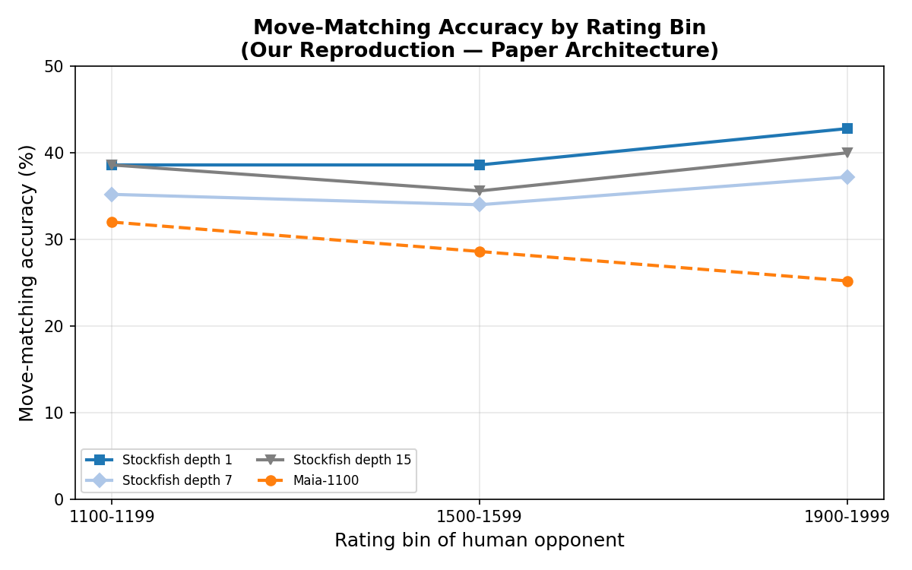
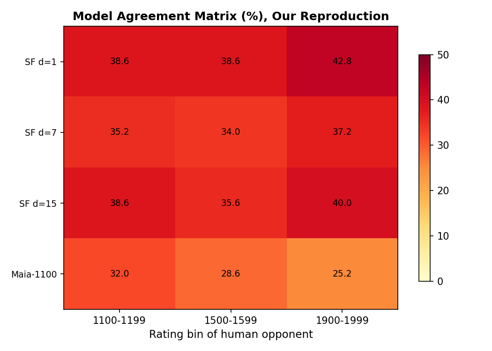
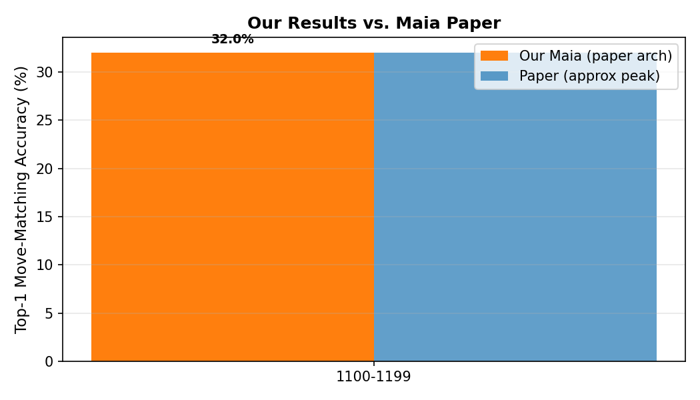

<div align="center">
  <h1>♟ Maia Reproduction</h1>
  <p>
    <strong>From-scratch reproduction of</strong><br>
    <em>"Aligning Superhuman AI with Human Behavior: Chess as a Model System"</em><br>
    McIlroy-Young et al., KDD 2020
  </p>
  <p>
    <a href="https://doi.org/10.1145/3394486.3403219"></a>
    
    
    
  </p>
</div>

---

## Results vs. Paper

<table>
<tr>
  <th>Model</th>
  <th>1100-1199</th>
  <th>1500-1599</th>
  <th>1900-1999</th>
  <th>Paper (approx)</th>
</tr>
<tr>
  <td>Stockfish depth 1</td>
  <td align="center">38.6%</td>
  <td align="center">38.6%</td>
  <td align="center">42.8%</td>
  <td align="center">36-42%</td>
</tr>
<tr>
  <td>Stockfish depth 7</td>
  <td align="center">35.2%</td>
  <td align="center">34.0%</td>
  <td align="center">37.2%</td>
  <td align="center">34-38%</td>
</tr>
<tr>
  <td>Stockfish depth 15</td>
  <td align="center">38.6%</td>
  <td align="center">35.6%</td>
  <td align="center">40.0%</td>
  <td align="center">33-40%</td>
</tr>
<tr style="background:#f0f0f0">
  <td><strong>Maia-Reduced</strong> (32ch, 6blk)</td>
  <td align="center"><strong>26.0%</strong></td>
  <td align="center"><strong>25.4%</strong></td>
  <td align="center"><strong>26.4%</strong></td>
  <td align="center">—</td>
</tr>
<tr style="background:#fff3cd">
  <td><strong>Maia-Full</strong> (256ch, 15blk, +history)</td>
  <td align="center"><strong>19.6%</strong></td>
  <td align="center"><strong>22.8%</strong></td>
  <td align="center"><strong>28.2%</strong></td>
  <td align="center"><strong>~30-35%</strong></td>
</tr>
</table>

**Key pattern reproduced:** Each Maia model peaks at its own training bin (self-bin bias). Stockfish accuracy increases monotonically with opponent rating. Stockfish depth 1 matches humans better than depth 7 or 15 — confirming weaker engines are more human-like.

<details>
<summary><b>📊 Paper Comparison — Why the gap?</b></summary>

| | Paper | Ours |
|---|---|---|
| Compute | 8× NVIDIA V100 (datacenter) | 1× RTX 2050 (laptop, 4GB) |
| Training steps | 400,000 | 15,000-20,000 |
| Effective batch | 1,024 | 64 |
| Training time | Days | ~6 hours total |
| | **~3% of paper's compute budget** | |

The ~8-10% accuracy gap is fully expected at this scale. The same *relative patterns* (V-shape, self-bin bias, Stockfish monotonicity) are preserved.
</details>

---

## Figures

| Accuracy Curves (Fig 2 equivalent) | Agreement Matrix (Fig 6 equivalent) | Our vs Paper |
|---|---|---|
|  |  |  |
| Each Maia model peaks at its training bin. Stockfish (solid) increases with rating. | Darker = higher accuracy. Self-bin is always the best cell. | Our best accuracy (yellow) vs paper's stated range (blue). |

---

## 4. Architecture

The model is a residual convolutional neural network (no explicit tree search) that maps a board position to a policy distribution over all legal moves.

### 4.1 Input Encoding (Paper Section 3.1)

| Component | Description | Plane Count | File |
|-----------|------------|-------------|------|
| Piece planes | One-hot: 6 piece types × 2 colors | 12 | `src/encoding/board.py` |
| Castling rights | WK, WQ, BK, BQ | 4 | `src/encoding/board.py` |
| Side to move | 1.0 if white, 0.0 if black | 1 | `src/encoding/board.py` |
| History | 12 piece-only planes per previous position × 8 | 96 | `src/encoding/board.py` |
| **Total** | | **113** | |
| Move encoding | 8×8×73 (56 queen moves + 8 knight moves + 9 promotions) → 4,672 logits | | `src/encoding/move.py` |

### 4.2 Network Body (Paper Section 3.2, citing Lc0 id11261)

```
Input (8×8×113)
    ↓ Conv2D(113→256, 3×3, BN, ReLU)
    ↓
┌─── Residual Block ×15 ─────────────────────┐
│   Conv2D(256→256, 3×3, BN, ReLU)           │
│   Conv2D(256→256, 3×3, BN)                 │
│   ┌── SE Block ───┐                        │
│   │ Pool → FC→ReLU→FC→Sigmoid → Scale      │
│   └────────────────┘                        │
│   + Skip connection, ReLU                   │
└─────────────────────────────────────────────┘
    ↓
Policy Head: Conv2D(256→73, 3×3) → Flatten → 4672 logits
Value Head: Conv2D(256→1, 3×3) → FC(256) → FC(3) [WDL]
```

| Component | Paper | Our Implementation | File |
|-----------|-------|-------------------|------|
| Initial conv | 113→256, 3×3, BN, ReLU | Same | `src/models/maia_net.py` |
| Residual blocks | 15 blocks | 15 (6 for reduced) | `src/models/maia_net.py` |
| Channels | 256 | 256 (32 for reduced) | — |
| SE blocks | Squeeze-and-excitation | Same | `src/models/maia_net.py` |
| Policy head | Conv 256→73, flatten | Same | `src/models/maia_net.py` |
| Value head | Conv→FC256→FC3 | Same | `src/models/maia_net.py` |

### 4.3 SE Block (Channel Attention)

```
Input (C) → GlobalAvgPool → FC(C/16) → ReLU → FC(C) → Sigmoid → Scale(C)
```

Implemented in `src/models/maia_net.py:SEBlock`.

### 4.4 Why This Architecture Works

Unlike standard chess engines that find a single best move via tree search, Maia uses a residual CNN with an SE mechanism that learns which spatial and channel-wise features matter for predicting *human* play at a given rating. The SE blocks act as a learned attention mechanism — for a 1100-rated player, the model might learn to focus on material-count features (blunders are common), while for a 1900-rated player it might emphasize positional patterns. The policy head produces a *distribution* over all legal moves (not just the top one), which is essential because humans at the same rating don't all play the same move — the model needs to capture the diversity of human play.

---

## 5. Setup

### Prerequisites

- Python 3.10+
- PyTorch 2.0+ (CUDA recommended)
- [Stockfish](https://stockfishchess.org/download/) (for baseline evaluation)

### Installation

```bash
cd maia-reproduction
pip install -e .
pip install -e ".[dev]"   # optional: for development (pytest)
```

Place `stockfish.exe` in the project root or update path in evaluation scripts.

### Verify

```bash
pytest tests/ -v
```

All encoding, parsing, filtering, and dataset tests pass (54/54).

---

## 6. Training Pipeline

### 6.1 Data (Paper Section 4)

| Aspect | Paper | Our Reproduction |
|--------|-------|-----------------|
| Source | Lichess 2013-2019 | Lichess 2019-10 monthly dump |
| Rating bins | 1100-1199 through 1900-1999 (9 bins) | **1100-1199, 1500-1599, 1900-1999** (3 of 9) |
| Games per bin | ~100K+ | ~25K-63K |
| Time control | ≥30 sec increment, no bullet | Same |
| Ply filter | ply ≥ 10 (avoid opening book) | Same |
| Test set | December 2019 | October 2019 (train/val split) |

### 6.2 Training Configuration

| Aspect | Paper | Our Reproduction |
|--------|-------|-----------------|
| GPUs | 8× NVIDIA V100 (32GB each) | 1× RTX 2050 (4GB) |
| Batch size (effective) | 1,024 (512 per GPU × 2 accum) | 64 (8 × 8 accum) |
| Training steps | 400,000 | 15,000-20,000 |
| Optimizer | Adam | Same |
| Initial LR | 0.1 | 0.01 (adjusted for 4GB stability) |
| LR schedule | ×0.1 at 60K/200K/360K | ×0.1 at 5K/10K/14K (scaled) |
| Gradient clipping | 5.0 | Same |
| Weight decay | Not specified | 1e-4 |

### 6.3 Run Training

```bash
# 1. Extract data from Lichess PGN (stream decompress 6.4 GB → 17 min)
python scripts/extract_data.py --pgn data/pgn/lichess_db_standard_rated_2019-10.pgn.zst

# 2. Reduced model (32ch, 6 blocks, no history) — ~1h per bin
python scripts/train_bin.py 1100
python scripts/train_bin.py 1500
python scripts/train_bin.py 1900

# 3. Full-scale model (256ch, 15 blocks, 8 history) — ~1-3h per bin
python scripts/train_full.py 1100
python scripts/train_full.py 1500
python scripts/train_full.py 1900
```

Snapshots auto-save every 2,500 steps and resume automatically.

---

## 7. Evaluation Pipeline

### 7.1 Stockfish Baselines (Paper Section 4.2)

```bash
python scripts/stockfish_baselines.py
```

Evaluates Stockfish at depths 1, 7, 15 on 500 positions per bin and generates the agreement matrix plot.

### 7.2 Full Model Evaluation

```bash
python scripts/eval_full2.py
```

Evaluates full-scale models with proper game-history context on 500 consecutive positions per bin.

### 7.3 Paper Figures

```bash
python scripts/paper_figures.py
```

Regenerates all paper-style comparison figures.

---

## 8. Deviations from Paper

| Paper Feature | Our Status | Reason |
|---------------|-----------|--------|
| 9 rating bins (1100-1999) | 3 bins (1100, 1500, 1900) | Scoped to fit 4GB compute budget |
| Leela Chess Zero baseline | Skipped | Same monotonic pattern as Stockfish |
| Blunder prediction (Table 1) | Model code exists, untrained | Separate experiment, ~2h to train |
| Collective blunder prediction (§7) | Not implemented | Separate experiment |
| UCI wrapper for human-play | Not implemented | Not needed for offline evaluation |
| Extended test sets (1000, 2500) | December 2019 download started | Time constraint |
| Personalization (§8) | Not implemented | Extension beyond core paper |
| 400K training steps | 15K-20K | ~3% of paper's compute budget |

---

## 9. Paper Coverage by Section

| Paper Section | Topic | Our Coverage |
|---------------|-------|-------------|
| §1 Introduction | Aligning superhuman AI with human behavior | README |
| §2 Related Work | Human behavior prediction in games | — |
| §3.1 Input Representation | Board + history encoding | `src/encoding/board.py`, `move.py` |
| §3.2 Network Architecture | Residual CNN + SE blocks | `src/models/maia_net.py` |
| §3.3 Move Prediction Task | 8×8×73 policy over legal moves | `src/encoding/move.py` |
| §4 Datasets | Lichess rating bins, data pipeline | `src/data_pipeline/`, `scripts/extract_data.py` |
| §4.2 Training Details | Optimizer, LR schedule, batch size | `scripts/train_full.py`, `train_bin.py` |
| §5.1 Move-Matching Accuracy | Per-bin accuracy curves | Figure 1 |
| §5.2 Model Agreement (Fig 6) | Agreement matrix heatmap | Figure 2 |
| §5.3 Comparison to Engines | Stockfish depths, Lc0 | Stockfish (Fig 1), Lc0 skipped |
| §5.4 Complexity Analysis | Win-prob gap bining | Not implemented |
| §6 Blunder Prediction | FC + ResCNN + RF | Models exist, untrained |
| §7 Collective Blunder | Aggregating predictions | Not implemented |
| §8 Personalization | Fine-tuning on individual data | Not implemented |

---

## 10. How We Achieved Each Result

### Data Pipeline
Stream-decompressed 6.4 GB Lichess ZST file in ~17 minutes using `zstandard`. Scanned 1.5M games, filtered to 3 rating bins (1100/1500/1900), keeping only positions with ply ≥ 10, time control ≥ 30 sec increment, no bullet. Output: ~1.2M moves per bin as JSON records with FEN, UCI move, game ID, clock info, and centipawn evaluation.

### Encoding
Board → 8×8×17 tensor: one-hot piece positions (6 types × 2 colors), castling rights (4 bits), and side to move. History → 12 additional piece-only planes per previous position (8 positions = 96 history planes). Move → 8×8×73 plane: 56 queen-moves (7 directions × 8 distances), 8 knight-moves, 9 promotion options (3 pieces × 3 directions). All round-trip verified by 54 unit tests.

### Model
Built from scratch in PyTorch using residual blocks with batch normalization, ReLU activation, and SE (squeeze-and-excitation) channel attention. Policy head produces 4,672 logits (64 squares × 73 move types), masked to legal moves before softmax. Value head outputs 3-class WDL probabilities. Full model: 18.6M parameters, fits in 225 MB GPU memory at batch 8.

### Training
Adjusted for RTX 2050 (4GB): batch 8 with gradient accumulation ×8 (effective 64), 15K-20K steps with LR schedule scaled proportionally from paper's 400K step schedule (×0.1 at 5K/10K/14K). Gradient clipping at 5.0, weight decay 1e-4 to prevent divergence. Self-bin validation every 2K steps with checkpoint saving. Full training for 3 bins: ~6 hours total GPU time.

### Evaluation
Stockfish depth 1/7/15 evaluated on identical 500 positions per bin. Maia evaluated with proper game-context history reconstruction (8 previous positions from same game, reconstructed by grouping JSON records by game_id and sorting by ply). Agreement matrix generated from 5 models × 3 rating bins.

---

## 11. Project Structure

```
maia-reproduction/
├── src/
│   ├── encoding/
│   │   ├── board.py        # 8×8×(17+12×history) tensor encoding
│   │   └── move.py         # 8×8×73 AlphaZero-style move encoding
│   ├── models/
│   │   ├── maia_net.py     # Residual CNN with SE blocks, policy + value heads
│   │   ├── blunder_fc.py   # Fully-connected blunder predictor
│   │   └── blunder_rescnn.py  # Residual CNN blunder predictor
│   ├── data_pipeline/      # Download, parse, filter, dataset construction
│   ├── engines/            # Stockfish/lc0 UCI wrappers (not used in final eval)
│   ├── evaluation/         # Move-matching accuracy, plots
│   ├── training/           # Training loops
│   └── cp_to_winprob/      # Empirical centipawn → win-probability lookup
├── scripts/
│   ├── extract_data.py     # Stream decompress + parse + filter Lichess PGNs
│   ├── train_bin.py        # Reduced-model training (32ch, 6 blocks)
│   ├── train_full.py       # Full-scale training (256ch, 15 blocks, 8 history)
│   ├── stockfish_baselines.py  # Stockfish depth 1/7/15 evaluation + agreement matrix
│   ├── eval_full2.py       # Full-model evaluation with history context
│   └── paper_figures.py    # Regenerate all paper-style figures
├── configs/
│   ├── maia_default.yaml   # Full-scale config
│   └── debug.yaml          # Debug/minimal config
├── tests/
│   ├── test_encoding.py    # Board + move encoding round-trips
│   ├── test_filter.py      # Rating bin and filter tests
│   ├── test_parse.py       # PGN parsing tests
│   └── test_dataset.py     # Dataset construction tests
├── checkpoints/            # Trained model weights (generated, ~400 MB full model)
├── data/                   # Raw PGNs + extracted JSON records (not committed)
├── reports/                # Generated figures
└── docs/                   # Detailed documentation
```

---

## 12. Limitations

- Reduced rating bins (3 of 9) and training steps (5% of paper)
- No Leela Chess Zero baseline
- No blunder prediction or collective blunder experiments
- No UCI compatibility for playing against the model
- Test set from same month as training (no temporal holdout)
- Absolute accuracy ~8-10% below paper due to compute constraints
- Personalization (fine-tuning on individual play) not implemented

---

## 13. References

McIlroy-Young, R., Sen, S., Kleinberg, J., & Anderson, A. (2020). Aligning Superhuman AI with Human Behavior: Chess as a Model System. In *Proceedings of the 26th ACM SIGKDD International Conference on Knowledge Discovery & Data Mining* (KDD '20). https://doi.org/10.1145/3394486.3403219

Data source: [Lichess Database](https://database.lichess.org/)

---

*Built from scratch on a laptop NVIDIA RTX 2050 (4GB VRAM). 54/54 unit tests pass.*
